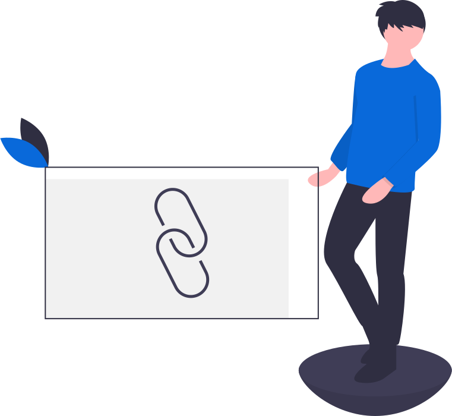

<div align="center">

<br />
<h1>URL Shortening Service</h1>
<p>
URL shortening service that allows users to shorten long URLs in to short URLs
</p>
<a href="https://github.com/iamrajiv/url-shortening-service/network/members"></a>
<a href="https://github.com/iamrajiv/url-shortening-service/stargazers"></a>
<a href="https://github.com/iamrajiv/url-shortening-service/blob/main/LICENSE"></a>
</div>

## About

This is a RESTful API for a URL shortening service that allows users to shorten long URLs in to short URLs. The API supports CRUD operations for short URLs.

The operations it supports are:

- List all short URLs (GET /api/v1/all)
- Create a short URL (POST /api/v1/create)
- Delete a short URL (POST /api/v1/delete)
- Update a short URL (POST /api/v1/update)

<div align="center">

</div>

Users will interact with the Go server, which will interact with the Redis server. Redis server is used as a cache server to store the short URLs.

#### Folder structure:

```shell
.
├── LICENSE
├── README.md
├── api
│   ├── Dockerfile
│   ├── database
│   │   └── database.go
│   ├── go.mod
│   ├── go.sum
│   ├── helpers
│   │   └── helpers.go
│   ├── main.go
│   └── routes
│       ├── resolve.go
│       └── shorten.go
├── assets
│   ├── url-shortening-service-1.svg
│   └── url-shortening-service-2.svg
├── db
│   └── Dockerfile
└── docker-compose.yaml
```

The `api` folder contains the Go code for the API. The `database` folder contains the code for the Redis server interaction. The `helpers` folder contains utility functions for the API. The `routes` folder contains the resolver and logic for the API endpoints.

## Usage

To run the project locally, run the following commands:

```shell
docker-compose up -d
```

The above command will start the Go server and Redis server in the background.

We can interact with the API using the following endpoints:

- List all short URLs

```shell

```

- Create a short URL

```shell

```

- Delete a short URL

```shell

```

- Update a short URL

```shell

```

## License

[MIT](https://github.com/iamrajiv/url-shortening-service/blob/main/LICENSE)
